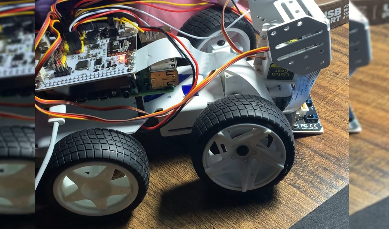
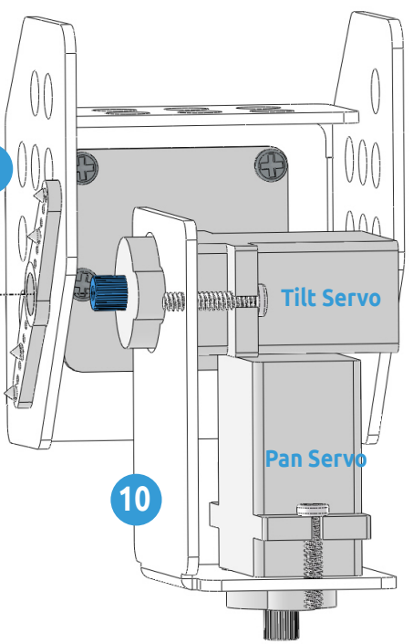

# RC-Device
RC device project is a class project for CNT 4104 - Software Proj Comp Networks. 
The purpose of this project is through building and programming real life remote device, learning knowledge on network. 

## Device used
* Raspberry Pi 4 Model B 2019 Quad Core 64 Bit WiFi Bluetooth (4GB)

* SunFounder Raspberry Pi Smart Video Robot Car Kit for Raspberry Pi, Python/Blockly (Like Scratch), Web Control, Line Tracking, Raspberry Pi Robot Kits for Teens and Adults (Raspberry Pi NOT Included) 

## Application used
* Putty - a network protocol used to allow secure access to a UNIX terminal

## Language used
* Python

## Acknowledgments/ Reference
* https://github.com/sunfounder/picar-x.git

## Code related Device Structure
1. 

