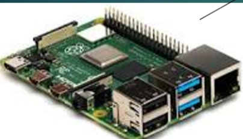

## RC-Device
RC device project is a class project for CNT 4104 - Software Proj Comp Networks.<br />
The purpose of this project is through building and programming real life remote device, learning knowledge on network.<br />

## Device used
* Raspberry Pi 4 Model B 2019 Quad Core 64 Bit WiFi Bluetooth (4GB)<br />
<br />
* SunFounder Raspberry Pi Smart Video Robot Car Kit for Raspberry Pi, Python/Blockly (Like Scratch), Web Control, Line Tracking, Raspberry Pi Robot Kits for Teens and Adults (Raspberry Pi NOT Included) <br />
<br />

## Application used
* Putty - a network protocol used to allow secure access to a UNIX terminal

## Language used
* Python

## Acknowledgments/ Reference
* https://github.com/sunfounder/picar-x.git

## Steps
### 1. Connect the Raspberry Pi to the Internet. 
* You need to modify a Wi-Fi configuration file wpa_supplicant.conf in the Micro SD card by your PC that is located in the directory /etc/wpa_supplicant/
* For linux: access the directory directly to modify the configuration file
* For windows:if your PC use Windows system, then you can’t access the directory and what you need next is to go to the directory, /boot/ to create a new file with the same name, wpa_supplicant.conf.
```
# replace “Wi-Fi-A” with your custom name of WiFi and “Sunfounder” with your password. 
ctrl_interface=DIR=/var/run/wpa_supplicant GROUP=netdev
update_config=1
country=GB
network={
ssid=”Wi-Fi-A” 
psk=”Sunfounder”
key_mgmt=WPA-PSK
priority=1
}
```


